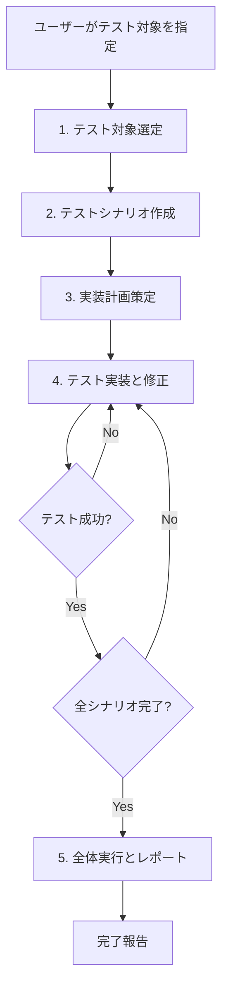

# Frontend Unit Test エージェントシステム

## 概要

このディレクトリには、Vue + Jest を使用したFrontend Unit Testの計画、生成、修正を自動化するエージェントシステムが格納されています。

GitHub Copilot のエージェントモードを使用し、複数のサブエージェントが連携してテストの全工程を実施します。

## アーキテクチャ

### オーケストレーターパターン

本システムは「オーケストレーターパターン」を採用しており、以下の構成になっています：

```
frontend-unit-test-orchestrator (オーケストレーター)
├── frontend-test-target-selection (テスト対象選定)
├── frontend-test-scenario-creator (シナリオ作成)
├── frontend-test-planner (実装計画)
├── frontend-test-implementer (実装・修正)
└── frontend-test-runner (全体実行・レポート)
```

### 各エージェントの責任

| エージェント | 責任 | やらないこと |
|------------|------|-------------|
| orchestrator | ワークフロー全体の進行管理 | テスト実装、シナリオ作成 |
| target-selection | テスト対象の特定と優先度付け | テストシナリオの作成 |
| scenario-creator | Given-When-Thenシナリオ作成 | テスト実装、対象選定 |
| planner | 実装順序とモック戦略の計画 | テスト実装、コード生成 |
| implementer | テストコード実装と修正 | 計画策定、全体実行 |
| runner | 全体実行とカバレッジレポート | テスト実装、計画策定 |

## 使用方法

### 基本的な使い方

1. **VS Code の GitHub Copilot Chat を開く**
2. **エージェントドロップダウンから `frontend-unit-test-orchestrator` を選択**
3. **テスト対象を指定して実行**

例:
```
src/frontend/src/views/AccountView.vue のユニットテストを作成してください
```

### 個別エージェントの使用

各サブエージェントは単体でも使用できます：

#### テスト対象の選定のみ
```
@frontend-test-target-selection
現在のプロジェクトでテストが不足しているファイルを教えてください
```

#### シナリオ作成のみ
```
@frontend-test-scenario-creator
AccountView.vue のテストシナリオを作成してください
```

#### テスト実装のみ
```
@frontend-test-implementer
AccountView.spec.js の TS-001 シナリオを実装してください
```

## 実行フロー

### 全体の流れ



### 詳細な工程

#### 工程1: テスト対象の選定
- 既存テストファイルの確認
- 未テストファイルの抽出
- カバレッジ状況の確認
- 優先度付けと選定

**成果物**: テスト対象リスト

#### 工程2: テストシナリオの作成
- テスト対象の詳細分析
- ISTQB標準技法の適用（同値分割、境界値分析等）
- Given-When-Then形式でシナリオ作成
- テストデータとモック要件の定義

**成果物**: テストシナリオ仕様書

#### 工程3: 実装計画の策定
- シナリオ間の依存関係分析
- 実装順序の決定（基本→応用）
- モック/スタブ戦略の設計
- フェーズ分割と完了条件の定義

**成果物**: 実装計画書

#### 工程4: テストの実装と修正
- フェーズごとに段階的実装
- 各実装後に即座にテスト実行
- 失敗時は原因分析して修正
- すべて成功するまで繰り返し

**成果物**: テストファイル (.spec.js)

#### 工程5: 全体実行とレポート
- 全テストの実行
- カバレッジレポートの生成
- 結果分析と評価
- 残課題と推奨事項の提示

**成果物**: 最終レポート

## 技術スタック

- **テストフレームワーク**: Jest v28+
- **Vueテストツール**: @vue/test-utils v2 (Vue 3対応)
- **テスト環境**: jsdom (jest-environment-jsdom)
- **カバレッジ**: Jest内蔵カバレッジ

## カバレッジ目標

| カテゴリ | 目標 |
|---------|------|
| ステートメントカバレッジ | ≥ 80% |
| 分岐カバレッジ | ≥ 70% |
| 重要なビジネスロジック | ≥ 95% |

## ベストプラクティス

### 1. data-testid 属性の使用
```vue
<p data-testid="user-id">{{ userId }}</p>
```

### 2. 適切な非同期処理の待機
```javascript
await wrapper.vm.$nextTick()
await new Promise(resolve => setTimeout(resolve, 10))
```

### 3. モックのクリーンアップ
```javascript
beforeEach(() => {
  jest.clearAllMocks()
})
```

### 4. Given-When-Then パターン
```javascript
it('should display user data successfully', async () => {
  // Given (Arrange)
  api.getUserData.mockResolvedValue({ user: { id: '123' } })
  
  // When (Act)
  wrapper = createWrapper()
  await wrapper.vm.$nextTick()
  
  // Then (Assert)
  expect(wrapper.find('[data-testid="user-id"]').text()).toBe('123')
})
```

## トラブルシューティング

### よくあるエラー

#### "Cannot call text on an empty DOMWrapper"
- **原因**: 要素が見つからない
- **対処**: セレクタの確認、非同期待機の延長

#### "localStorage is not defined"
- **原因**: jsdom環境が未設定
- **対処**: jest.config.js の確認、jest-environment-jsdom のインストール

#### テストが間欠的に失敗
- **原因**: 非同期処理の待機不足
- **対処**: 待機時間を延長（10ms → 50ms）

### デバッグ方法

```bash
# 詳細なエラー情報を表示
npm test -- --verbose AccountView.spec.js

# 特定のテストケースのみ実行
npm test -- --testNamePattern="should display user data"

# watchモードで実行
npm test -- --watch
```

## 参考資料

### プロジェクト内資料
- [Frontend Unit Test ドキュメント](../../docs/08_Frontend_UnitTest.md)
- [単体テスト工程標準](../../develop-standard/develop-standard/unit-testing.md)

### 外部資料
- [Jest公式ドキュメント](https://jestjs.io/)
- [Vue Test Utils公式ドキュメント](https://test-utils.vuejs.org/)
- [ISTQB Foundation Level Syllabus](https://www.istqb.org/)

### 設計参考
- [GitHub Copilot サブエージェントによるオーケストレーター パターンの実践](https://zenn.dev/openjny/articles/e11450f61d067f)

## ファイル構成

```
.github/agents/
├── README.md (このファイル)
├── frontend-unit-test-orchestrator.agent.md (メインオーケストレーター)
├── frontend-test-target-selection.agent.md (工程1: テスト対象選定)
├── frontend-test-scenario-creator.agent.md (工程2: シナリオ作成)
├── frontend-test-planner.agent.md (工程3: 実装計画)
├── frontend-test-implementer.agent.md (工程4: 実装・修正)
└── frontend-test-runner.agent.md (工程5: 全体実行・レポート)
```

## 注意事項

### オートメーション対応
- エージェントはユーザーインタラクションを求めません
- `/dev/null` の使用は避けています（自動化中断を防ぐため）

### 責任境界の明確化
- 各エージェントは自分の責任範囲のみを実施
- オーケストレーターは指揮のみで実装は行わない

### エラーハンドリング
- 各工程でエラーが発生した場合は詳細情報を報告
- 最大3回の修正試行後も失敗する場合は人間の介入を推奨

## 今後の拡張

### 短期
- [ ] E2Eテストエージェントとの連携
- [ ] テストデータフィクスチャの自動生成
- [ ] CI/CD統合サポート

### 中期
- [ ] ビジュアルリグレッションテスト対応
- [ ] パフォーマンステスト対応
- [ ] カバレッジ可視化ダッシュボード

### 長期
- [ ] AIによるテストシナリオの最適化
- [ ] 自動テストメンテナンス
- [ ] クロスブラウザテスト対応

## ライセンス

本プロジェクトに準拠

## 貢献

改善提案やバグ報告は Issue または Pull Request でお願いします。

---

**作成日**: 2025-12-13
**最終更新**: 2025-12-13
**バージョン**: 1.0.0
