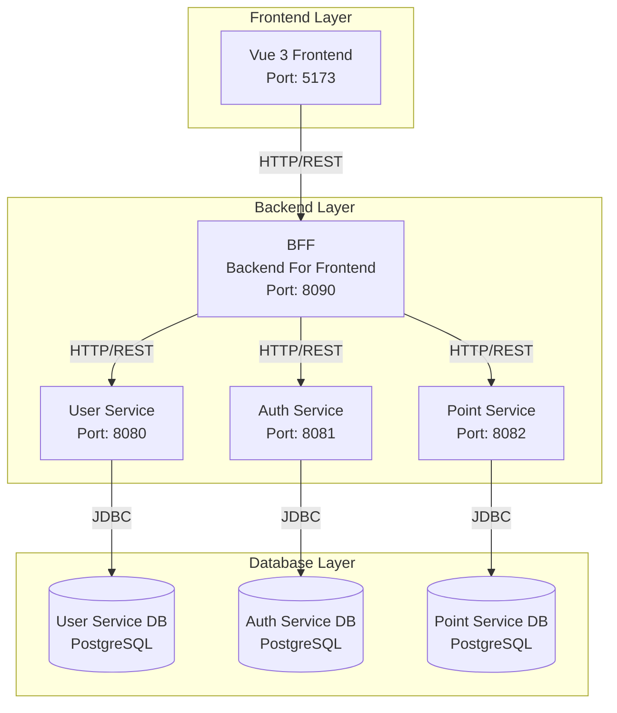

# サービス概要

## システム全体の概要

本システムは、Java 11 + Payara Micro + PostgreSQL + Vue 3 で構築されたマイクロサービス風味のアーキテクチャのアプリケーションです。ユーザー管理、認証、ポイント管理機能を提供する5つのサービスで構成されています。

## アーキテクチャ図

## 各サービスの役割

### 1. Frontend（Vue 3）

**役割**: ユーザーインターフェースを提供するSPAアプリケーション

**技術スタック**:
- Vue 3
- Vite
- Tailwind CSS
- Vue Router

**主な機能**:
- ログイン画面
- アカウント情報表示画面
- ポイント残高表示画面
- ポイント履歴表示画面

**ポート**: 5173（開発時）

---

### 2. BFF（Backend For Frontend）

**役割**: フロントエンドとバックエンドサービス間のゲートウェイとして機能

**技術スタック**:
- Java 11
- Jakarta EE (JAX-RS)
- Payara Micro

**主な機能**:
- フロントエンドからのリクエストをバックエンドサービスにプロキシ
- 各マイクロサービスのレスポンスを集約
- 認証トークンの検証と転送
- エラーハンドリング（サービス停止時のエラー対応など）

**ポート**: 8090  
**デバッグポート**: 5008

---

### 3. User Service

**役割**: ユーザー情報の管理を担当

**技術スタック**:
- Java 11
- Jakarta EE (JAX-RS)
- Payara Micro
- PostgreSQL

**主な機能**:
- ユーザーの作成・取得・更新・削除（CRUD操作）
- ユーザー名またはIDでのユーザー検索
- ユーザーとポイント情報を統合したアカウント情報の取得

**ポート**: 8080  
**デバッグポート**: 5005  
**データベース**: user_service_db

---

### 4. Auth Service

**役割**: 認証・認可の管理を担当

**技術スタック**:
- Java 11
- Jakarta EE (JAX-RS)
- Payara Micro
- PostgreSQL
- JWT (JSON Web Token)
- BCrypt（パスワードハッシュ化）

**主な機能**:
- ユーザーログイン（ユーザーIDまたはユーザー名でのログイン）
- ログアウト
- JWTトークンの生成と検証
- セッション管理（レガシートークンもサポート）
- ログイン履歴の記録

**ポート**: 8081  
**デバッグポート**: 5006  
**データベース**: auth_service_db

---

### 5. Point Service

**役割**: ポイント残高とポイント履歴の管理を担当

**技術スタック**:
- Java 11
- Jakarta EE (JAX-RS)
- Payara Micro
- PostgreSQL
- JWT認証

**主な機能**:
- ポイント残高の取得
- ポイント履歴の取得（ページネーション対応）
- ポイント付与（EARN）
- ポイント使用（USE）
- ポイント履歴の各時点での残高計算

**ポート**: 8082  
**デバッグポート**: 5007  
**データベース**: point_service_db

---

## データベース設計方針

各サービスは**独立したPostgreSQLデータベース**を持ち、マイクロサービスアーキテクチャの原則である「Database per Service」パターンを採用しています。

- **user_service_db**: ユーザー基本情報
- **auth_service_db**: 認証情報、セッション、ログイン履歴
- **point_service_db**: ポイント残高とポイント履歴

各データベース間でのデータの共有は、サービス間のREST API呼び出しを通じて行われます。

---

## 環境構成

### 開発環境
- DevContainerによる統一された開発環境
- 各サービスは `.env` ファイルから環境変数を読み込み
- 開発用DBはDevContainer起動時に自動的に構築

### E2Eテスト環境
- TestContainersによる独立したテスト用DB環境
- `.env.e2e` ファイルが自動生成され、テスト専用DBに接続
- テスト実行後は自動的にクリーンアップ

---

## セキュリティ

- パスワードは**BCrypt**でハッシュ化して保存
- 認証には**JWT（JSON Web Token）**を使用
- サービス間通信時にもJWTトークンを検証
- CORS設定によりフロントエンドからのアクセスを制御
