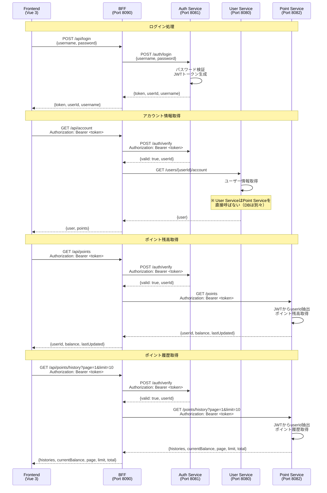
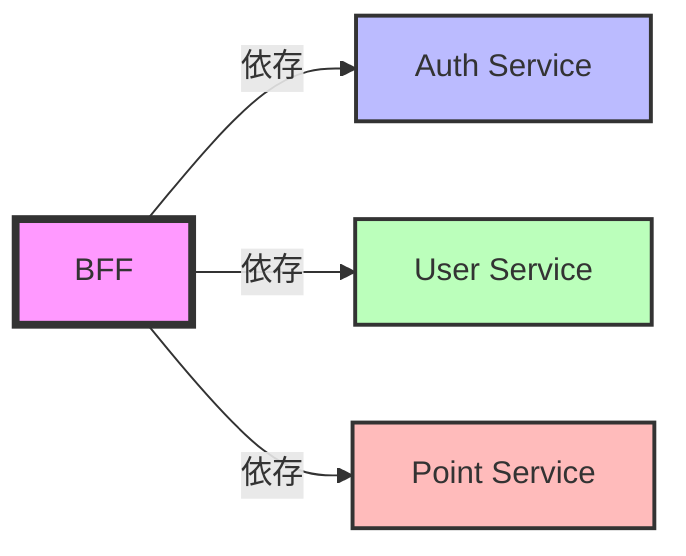

# サービス間通信経路

## 通信プロトコル

すべてのサービス間通信は**HTTP/REST**で行われます。

## 通信経路図



## 通信パターン

### 1. Frontend → BFF

- **プロトコル**: HTTP/REST
- **認証**: JWT Bearer Token（ログイン後）
- **URL**: `http://localhost:8090/api/*`

Frontendは常にBFFを経由してバックエンドサービスにアクセスします。直接バックエンドサービスにアクセスすることはありません。

### 2. BFF → Auth Service

- **プロトコル**: HTTP/REST
- **URL**: `http://localhost:8081/auth/*`
- **主な用途**:
  - ログイン処理
  - トークン検証
  - ログアウト処理

BFFは認証が必要なエンドポイントにアクセスする前に、Auth Serviceでトークンを検証します。

### 3. BFF → User Service

- **プロトコル**: HTTP/REST
- **URL**: `http://localhost:8080/api/*`
- **主な用途**:
  - ユーザー情報の取得
  - ユーザーアカウント情報の取得

### 4. BFF → Point Service

- **プロトコル**: HTTP/REST
- **URL**: `http://localhost:8082/point-service/api/*`
- **認証**: JWT Bearer Token
- **主な用途**:
  - ポイント残高の取得
  - ポイント履歴の取得

Point ServiceはJWTトークンを検証し、トークンに含まれるuserIdを使用してポイント情報を取得します。

## サービス間の依存関係



## 環境変数による設定

各サービスの接続先URLは環境変数で設定可能です。

### BFFの環境変数

```bash
# Auth Service URL
AUTH_SERVICE_URL=http://localhost:8081

# User Service URL
USER_SERVICE_URL=http://localhost:8080

# Point Service URL
POINT_SERVICE_URL=http://localhost:8082
```

### 開発環境での設定

開発環境では、各サービスは以下のポートで起動します：

- Frontend: 5173
- BFF: 8090
- User Service: 8080
- Auth Service: 8081
- Point Service: 8082

### E2Eテスト環境

E2Eテスト実行時は、TestContainersにより動的にポートが割り当てられ、`.env.e2e`ファイルに記載されます。

## エラーハンドリング

### サービス停止時の対応

BFFは各バックエンドサービスの停止を検知し、適切なエラーレスポンスを返します。

- **Auth Service停止時**: `401 Unauthorized`
- **User Service停止時**: `503 Service Unavailable`
- **Point Service停止時**: `503 Service Unavailable`

### タイムアウト設定

各サービス間の通信にはタイムアウトが設定されており、長時間の応答待ちを防ぎます。

## セキュリティ

### JWT検証フロー

1. FrontendからBFFへのリクエストにJWTトークンを含める
2. BFFはAuth ServiceでJWTトークンを検証
3. 検証成功後、各バックエンドサービスにリクエストを転送
4. Point ServiceなどJWT対応サービスは、独自にJWTを検証

### CORS設定

Frontendからのクロスオリジンリクエストを許可するため、BFFではCORS設定が必要です。

## データ整合性

各サービスは独立したデータベースを持つため、データの整合性は以下の方法で保ちます：

- **userId**: 共通のUUIDを使用して各サービス間でユーザーを識別
- **トランザクション**: サービスをまたぐトランザクションは実装されていないため、最終的整合性を前提とした設計
