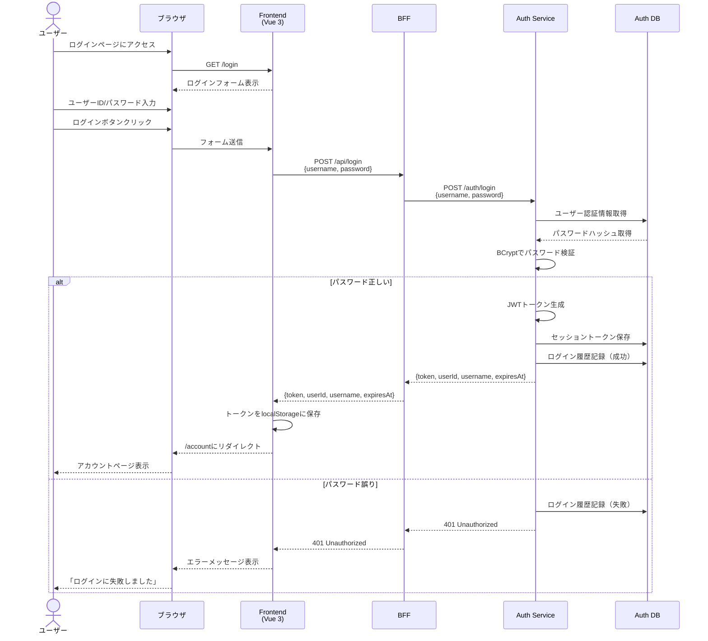
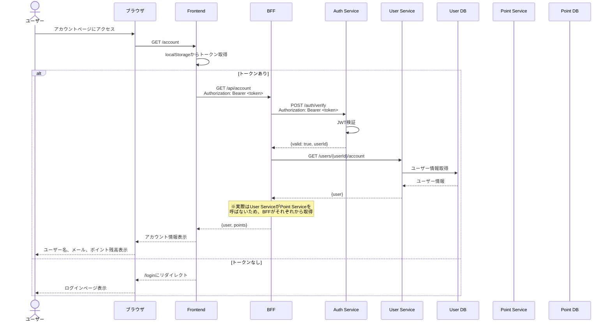
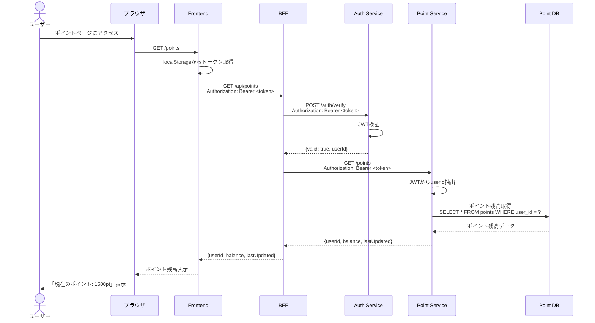
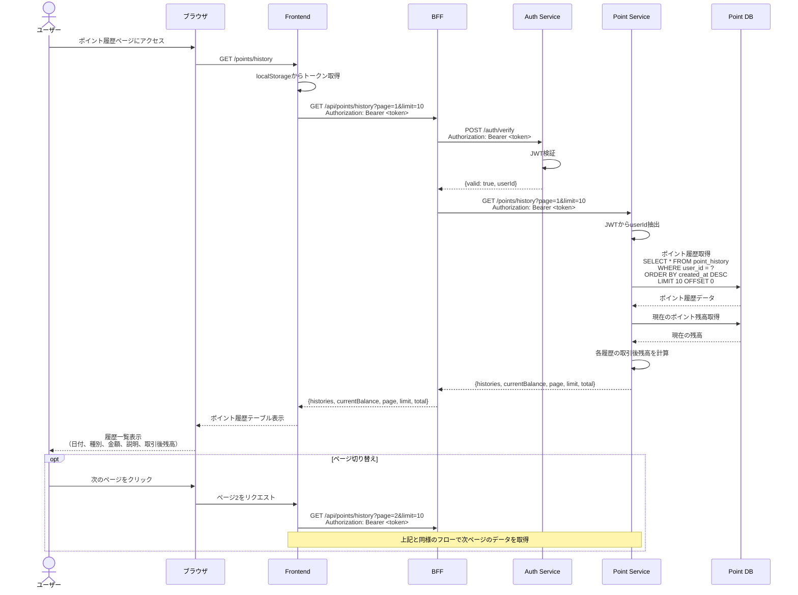
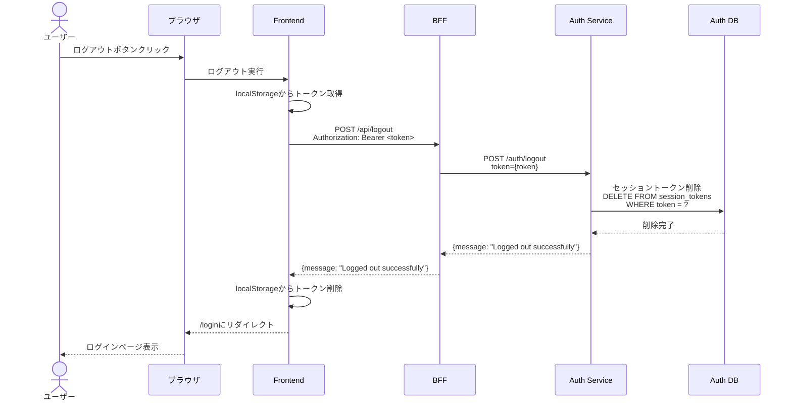
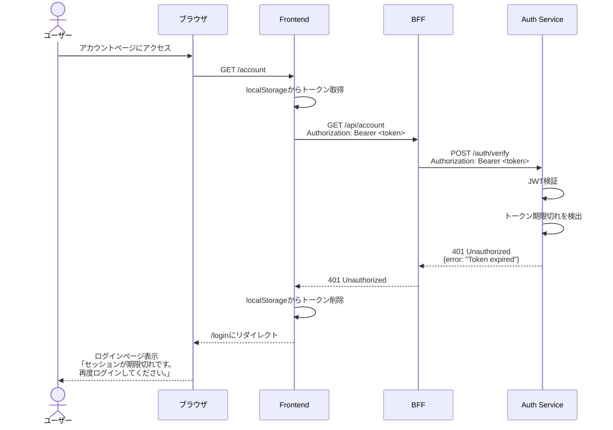
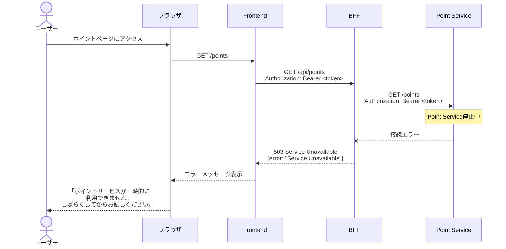

# ユーザー利用時のシーケンス図

## ログインシーケンス

```mermaid
sequenceDiagram
    actor User as ユーザー
    participant Browser as ブラウザ
    participant FE as Frontend<br/>(Vue 3)
    participant BFF as BFF
    participant Auth as Auth Service
    participant DB_Auth as Auth DB
    
    User->>Browser: ログインページにアクセス
    Browser->>FE: GET /login
    FE-->>Browser: ログインフォーム表示
    
    User->>Browser: ユーザーID/パスワード入力
    User->>Browser: ログインボタンクリック
    
    Browser->>FE: フォーム送信
    FE->>BFF: POST /api/login<br/>{username, password}
    
    BFF->>Auth: POST /auth/login<br/>{username, password}
    Auth->>DB_Auth: ユーザー認証情報取得
    DB_Auth-->>Auth: パスワードハッシュ取得
    
    Auth->>Auth: BCryptでパスワード検証
    
    alt パスワード正しい
        Auth->>Auth: JWTトークン生成
        Auth->>DB_Auth: セッショントークン保存
        Auth->>DB_Auth: ログイン履歴記録（成功）
        Auth-->>BFF: {token, userId, username, expiresAt}
        BFF-->>FE: {token, userId, username, expiresAt}
        FE->>FE: トークンをlocalStorageに保存
        FE-->>Browser: /accountにリダイレクト
        Browser-->>User: アカウントページ表示
    else パスワード誤り
        Auth->>DB_Auth: ログイン履歴記録（失敗）
        Auth-->>BFF: 401 Unauthorized
        BFF-->>FE: 401 Unauthorized
        FE-->>Browser: エラーメッセージ表示
        Browser-->>User: 「ログインに失敗しました」
    end
```

---

## アカウント情報表示シーケンス

```mermaid
sequenceDiagram
    actor User as ユーザー
    participant Browser as ブラウザ
    participant FE as Frontend
    participant BFF as BFF
    participant Auth as Auth Service
    participant User_S as User Service
    participant DB_User as User DB
    participant Point_S as Point Service
    participant DB_Point as Point DB
    
    User->>Browser: アカウントページにアクセス
    Browser->>FE: GET /account
    
    FE->>FE: localStorageからトークン取得
    
    alt トークンあり
        FE->>BFF: GET /api/account<br/>Authorization: Bearer <token>
        
        BFF->>Auth: POST /auth/verify<br/>Authorization: Bearer <token>
        Auth->>Auth: JWT検証
        Auth-->>BFF: {valid: true, userId}
        
        BFF->>User_S: GET /users/{userId}/account
        User_S->>DB_User: ユーザー情報取得
        DB_User-->>User_S: ユーザー情報
        User_S-->>BFF: {user}
        
        Note over BFF: ※実際はUser ServiceがPoint Serviceを<br/>呼ばないため、BFFがそれぞれから取得
        
        BFF-->>FE: {user, points}
        FE-->>Browser: アカウント情報表示
        Browser-->>User: ユーザー名、メール、ポイント残高表示
    else トークンなし
        FE-->>Browser: /loginにリダイレクト
        Browser-->>User: ログインページ表示
    end
```

---

## ポイント残高表示シーケンス

```mermaid
sequenceDiagram
    actor User as ユーザー
    participant Browser as ブラウザ
    participant FE as Frontend
    participant BFF as BFF
    participant Auth as Auth Service
    participant Point_S as Point Service
    participant DB_Point as Point DB
    
    User->>Browser: ポイントページにアクセス
    Browser->>FE: GET /points
    
    FE->>FE: localStorageからトークン取得
    FE->>BFF: GET /api/points<br/>Authorization: Bearer <token>
    
    BFF->>Auth: POST /auth/verify<br/>Authorization: Bearer <token>
    Auth->>Auth: JWT検証
    Auth-->>BFF: {valid: true, userId}
    
    BFF->>Point_S: GET /points<br/>Authorization: Bearer <token>
    Point_S->>Point_S: JWTからuserId抽出
    Point_S->>DB_Point: ポイント残高取得<br/>SELECT * FROM points WHERE user_id = ?
    DB_Point-->>Point_S: ポイント残高データ
    Point_S-->>BFF: {userId, balance, lastUpdated}
    
    BFF-->>FE: {userId, balance, lastUpdated}
    FE-->>Browser: ポイント残高表示
    Browser-->>User: 「現在のポイント: 1500pt」表示
```

---

## ポイント履歴表示シーケンス

```mermaid
sequenceDiagram
    actor User as ユーザー
    participant Browser as ブラウザ
    participant FE as Frontend
    participant BFF as BFF
    participant Auth as Auth Service
    participant Point_S as Point Service
    participant DB_Point as Point DB
    
    User->>Browser: ポイント履歴ページにアクセス
    Browser->>FE: GET /points/history
    
    FE->>FE: localStorageからトークン取得
    FE->>BFF: GET /api/points/history?page=1&limit=10<br/>Authorization: Bearer <token>
    
    BFF->>Auth: POST /auth/verify<br/>Authorization: Bearer <token>
    Auth->>Auth: JWT検証
    Auth-->>BFF: {valid: true, userId}
    
    BFF->>Point_S: GET /points/history?page=1&limit=10<br/>Authorization: Bearer <token>
    Point_S->>Point_S: JWTからuserId抽出
    Point_S->>DB_Point: ポイント履歴取得<br/>SELECT * FROM point_history<br/>WHERE user_id = ?<br/>ORDER BY created_at DESC<br/>LIMIT 10 OFFSET 0
    DB_Point-->>Point_S: ポイント履歴データ
    
    Point_S->>DB_Point: 現在のポイント残高取得
    DB_Point-->>Point_S: 現在の残高
    
    Point_S->>Point_S: 各履歴の取引後残高を計算
    Point_S-->>BFF: {histories, currentBalance, page, limit, total}
    
    BFF-->>FE: {histories, currentBalance, page, limit, total}
    FE-->>Browser: ポイント履歴テーブル表示
    Browser-->>User: 履歴一覧表示<br/>（日付、種別、金額、説明、取引後残高）
    
    opt ページ切り替え
        User->>Browser: 次のページをクリック
        Browser->>FE: ページ2をリクエスト
        FE->>BFF: GET /api/points/history?page=2&limit=10<br/>Authorization: Bearer <token>
        Note over FE,Point_S: 上記と同様のフローで次ページのデータを取得
    end
```

---

## ログアウトシーケンス

```mermaid
sequenceDiagram
    actor User as ユーザー
    participant Browser as ブラウザ
    participant FE as Frontend
    participant BFF as BFF
    participant Auth as Auth Service
    participant DB_Auth as Auth DB
    
    User->>Browser: ログアウトボタンクリック
    Browser->>FE: ログアウト実行
    
    FE->>FE: localStorageからトークン取得
    FE->>BFF: POST /api/logout<br/>Authorization: Bearer <token>
    
    BFF->>Auth: POST /auth/logout<br/>token={token}
    Auth->>DB_Auth: セッショントークン削除<br/>DELETE FROM session_tokens<br/>WHERE token = ?
    DB_Auth-->>Auth: 削除完了
    Auth-->>BFF: {message: "Logged out successfully"}
    
    BFF-->>FE: {message: "Logged out successfully"}
    FE->>FE: localStorageからトークン削除
    FE-->>Browser: /loginにリダイレクト
    Browser-->>User: ログインページ表示
```

---

## エラーハンドリングシーケンス

### トークン期限切れの場合

```mermaid
sequenceDiagram
    actor User as ユーザー
    participant Browser as ブラウザ
    participant FE as Frontend
    participant BFF as BFF
    participant Auth as Auth Service
    
    User->>Browser: アカウントページにアクセス
    Browser->>FE: GET /account
    
    FE->>FE: localStorageからトークン取得
    FE->>BFF: GET /api/account<br/>Authorization: Bearer <token>
    
    BFF->>Auth: POST /auth/verify<br/>Authorization: Bearer <token>
    Auth->>Auth: JWT検証
    Auth->>Auth: トークン期限切れを検出
    Auth-->>BFF: 401 Unauthorized<br/>{error: "Token expired"}
    
    BFF-->>FE: 401 Unauthorized
    FE->>FE: localStorageからトークン削除
    FE-->>Browser: /loginにリダイレクト
    Browser-->>User: ログインページ表示<br/>「セッションが期限切れです。<br/>再度ログインしてください。」
```

### サービス停止時のエラー

```mermaid
sequenceDiagram
    actor User as ユーザー
    participant Browser as ブラウザ
    participant FE as Frontend
    participant BFF as BFF
    participant Point_S as Point Service
    
    User->>Browser: ポイントページにアクセス
    Browser->>FE: GET /points
    
    FE->>BFF: GET /api/points<br/>Authorization: Bearer <token>
    
    BFF->>Point_S: GET /points<br/>Authorization: Bearer <token>
    Note over Point_S: Point Service停止中
    Point_S--xBFF: 接続エラー
    
    BFF-->>FE: 503 Service Unavailable<br/>{error: "Service Unavailable"}
    FE-->>Browser: エラーメッセージ表示
    Browser-->>User: 「ポイントサービスが一時的に<br/>利用できません。<br/>しばらくしてからお試しください。」
```
