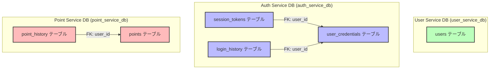
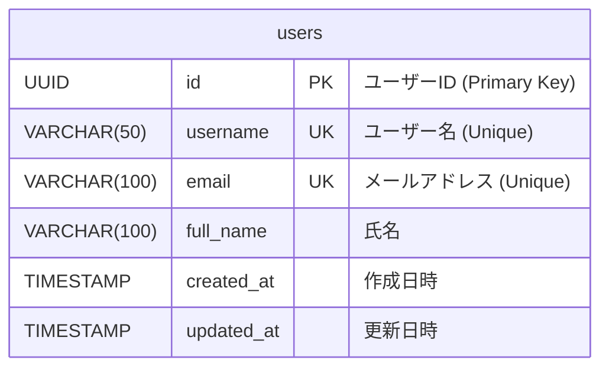
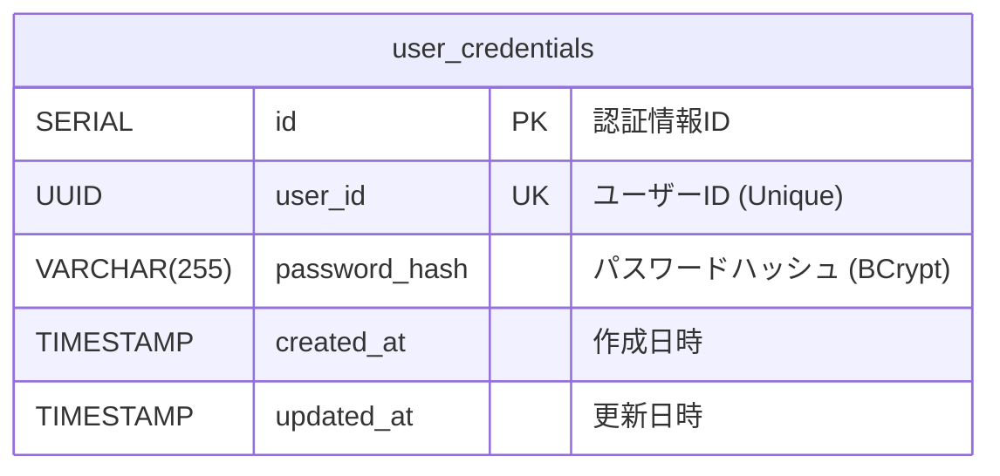
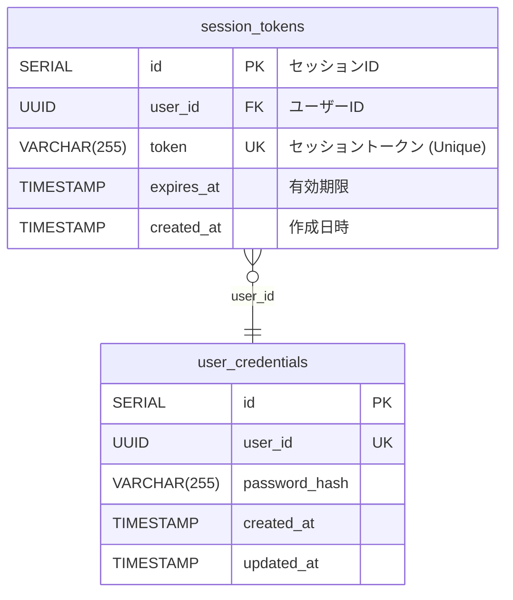
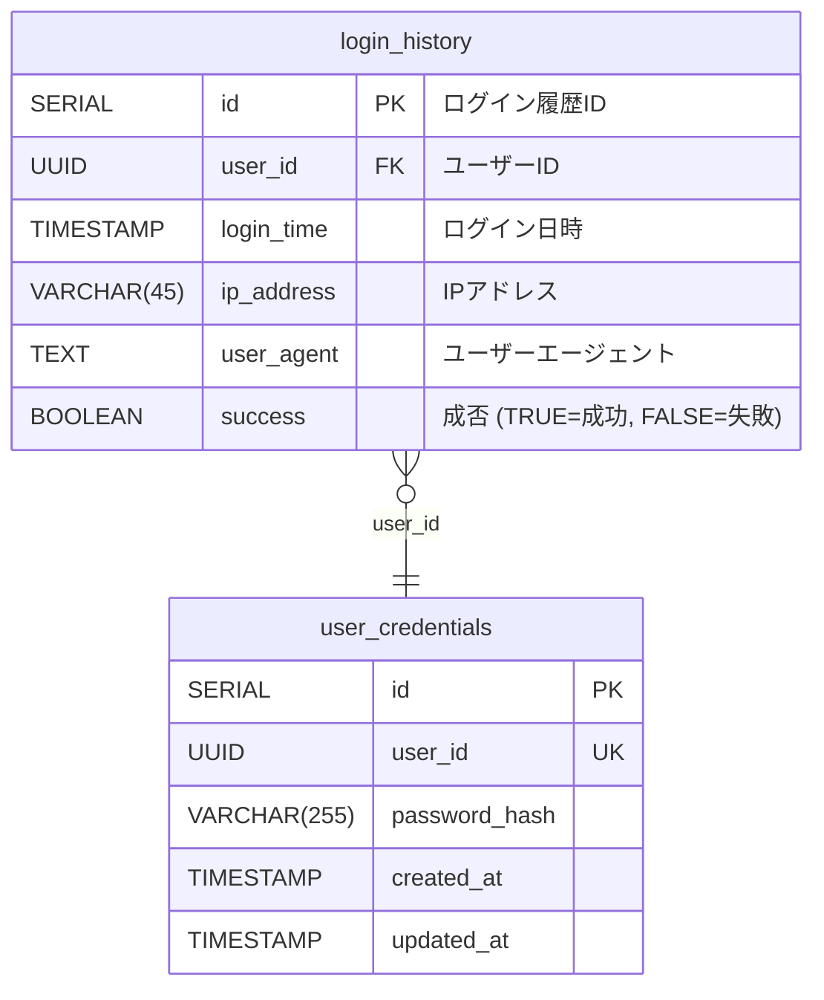
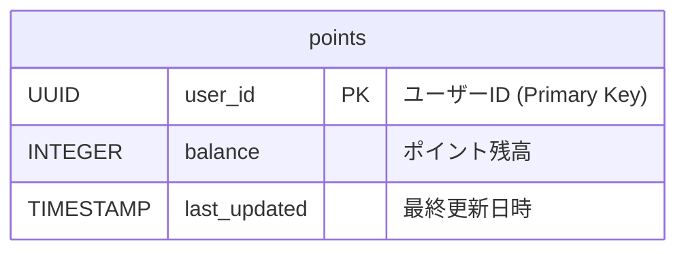
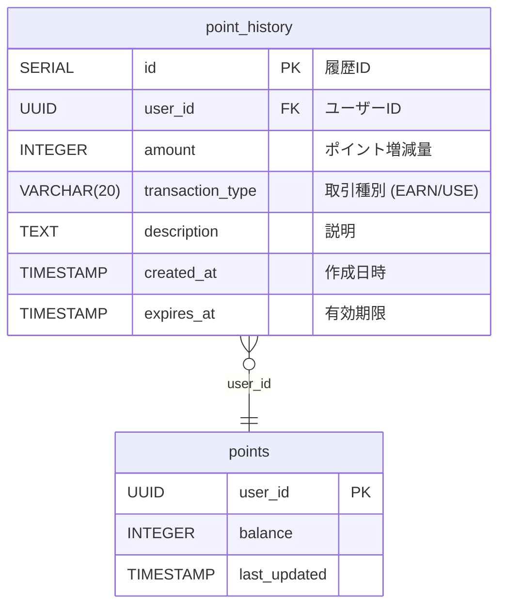

# データベース構造（ER図）

本システムでは、マイクロサービスアーキテクチャの原則に従い、各サービスが独立したデータベースを持っています。

## データベース構成概要



**注意**: 各データベース間には**外部キー制約はありません**。サービス間でのデータ整合性は、共通の`userId`（UUID）を使用して論理的に保たれます。

---

## 1. User Service DB（user_service_db）

### usersテーブル



**役割**: ユーザーの基本情報を管理

**制約**:
- `id`: PRIMARY KEY, UUID型、自動生成（`gen_random_uuid()`）
- `username`: UNIQUE, NOT NULL
- `email`: UNIQUE, NOT NULL
- `full_name`: NOT NULL

**インデックス**:
- `idx_users_username` on `username`
- `idx_users_email` on `email`

---

## 2. Auth Service DB（auth_service_db）

### user_credentialsテーブル



**役割**: ユーザーの認証情報（パスワードハッシュ）を管理

**制約**:
- `id`: PRIMARY KEY, SERIAL
- `user_id`: UNIQUE, NOT NULL
- `password_hash`: NOT NULL（BCryptでハッシュ化されたパスワード）

**インデックス**:
- `idx_user_credentials_user_id` on `user_id`

---

### session_tokensテーブル



**役割**: ユーザーのセッショントークンを管理（レガシートークン用）

**制約**:
- `id`: PRIMARY KEY, SERIAL
- `token`: UNIQUE, NOT NULL
- `user_id`: FOREIGN KEY → `user_credentials(user_id)` ON DELETE CASCADE
- `expires_at`: NOT NULL

**インデックス**:
- `idx_session_tokens_token` on `token`
- `idx_session_tokens_user_id` on `user_id`

---

### login_historyテーブル



**役割**: ログイン履歴（成功・失敗含む）を記録

**制約**:
- `id`: PRIMARY KEY, SERIAL
- `user_id`: FOREIGN KEY → `user_credentials(user_id)` ON DELETE CASCADE
- `success`: NOT NULL, DEFAULT TRUE

**インデックス**:
- `idx_login_history_user_id` on `user_id`

---

## 3. Point Service DB（point_service_db）

### pointsテーブル



**役割**: ユーザーのポイント残高を管理

**制約**:
- `user_id`: PRIMARY KEY, UUID
- `balance`: NOT NULL, DEFAULT 0

---

### point_historyテーブル



**役割**: ポイント取引履歴を記録

**制約**:
- `id`: PRIMARY KEY, SERIAL
- `user_id`: FOREIGN KEY → `points(user_id)` ON DELETE CASCADE
- `amount`: NOT NULL
- `transaction_type`: NOT NULL（'EARN' または 'USE'）

**インデックス**:
- `idx_point_history_user_id` on `user_id`
- `idx_point_history_created_at` on `created_at`

---

## サービス間のデータ連携

各サービスのデータベースは完全に独立しており、外部キーによる制約は存在しません。データの整合性は以下の方法で保たれています：

### 共通識別子: userId（UUID）

すべてのサービスで同一のUUID形式の`userId`を使用してユーザーを識別します。

**例**:
- User Service の `users.id`
- Auth Service の `user_credentials.user_id`
- Point Service の `points.user_id`

これらはすべて同じUUID値を持ち、論理的に同一ユーザーを指します。

### データ連携パターン

1. **ユーザー作成時**:
   - User Service で `users` テーブルにユーザーを作成（UUIDを生成）
   - 同じUUIDを使ってAuth Serviceで `user_credentials` を作成
   - 同じUUIDを使ってPoint Serviceで `points` を作成

2. **ユーザー削除時**:
   - 各サービスで独立して削除処理を実行
   - トランザクションの整合性は保証されない（最終的整合性）

### データベース接続情報

各サービスは環境変数から接続情報を読み込みます：

**User Service**:
```env
DB_USER_SERVICE_HOST=localhost
DB_USER_SERVICE_PORT=5432
DB_USER_SERVICE_NAME=user_service_db
DB_USER_SERVICE_USER=postgres
DB_USER_SERVICE_PASSWORD=postgres
```

**Auth Service**:
```env
DB_AUTH_SERVICE_HOST=localhost
DB_AUTH_SERVICE_PORT=5432
DB_AUTH_SERVICE_NAME=auth_service_db
DB_AUTH_SERVICE_USER=postgres
DB_AUTH_SERVICE_PASSWORD=postgres
```

**Point Service**:
```env
DB_POINT_SERVICE_HOST=localhost
DB_POINT_SERVICE_PORT=5432
DB_POINT_SERVICE_NAME=point_service_db
DB_POINT_SERVICE_USER=postgres
DB_POINT_SERVICE_PASSWORD=postgres
```

---

## データベース初期化

各サービスのデータベースは以下のSQLファイルで初期化されます：

- **スキーマ定義**: `database/schema.sql`
- **Seedデータ**: `database/seed.sql`

これらは開発環境（DevContainer）起動時、およびE2Eテスト実行時（TestContainers）に自動的に実行されます。
