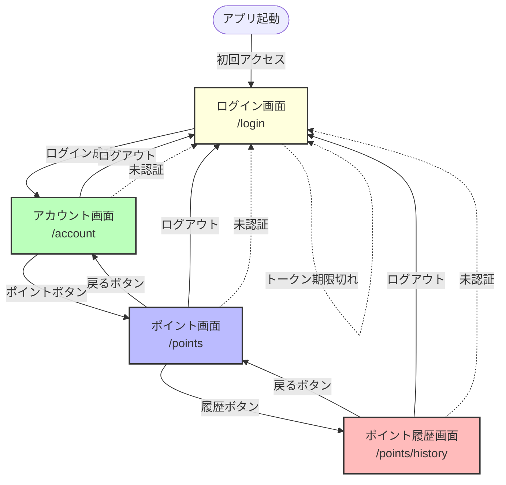
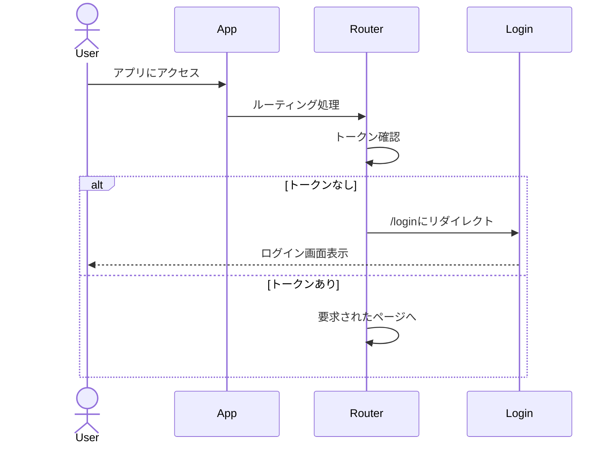
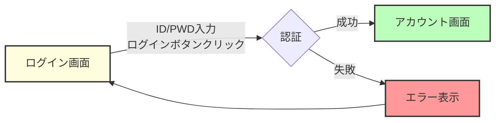
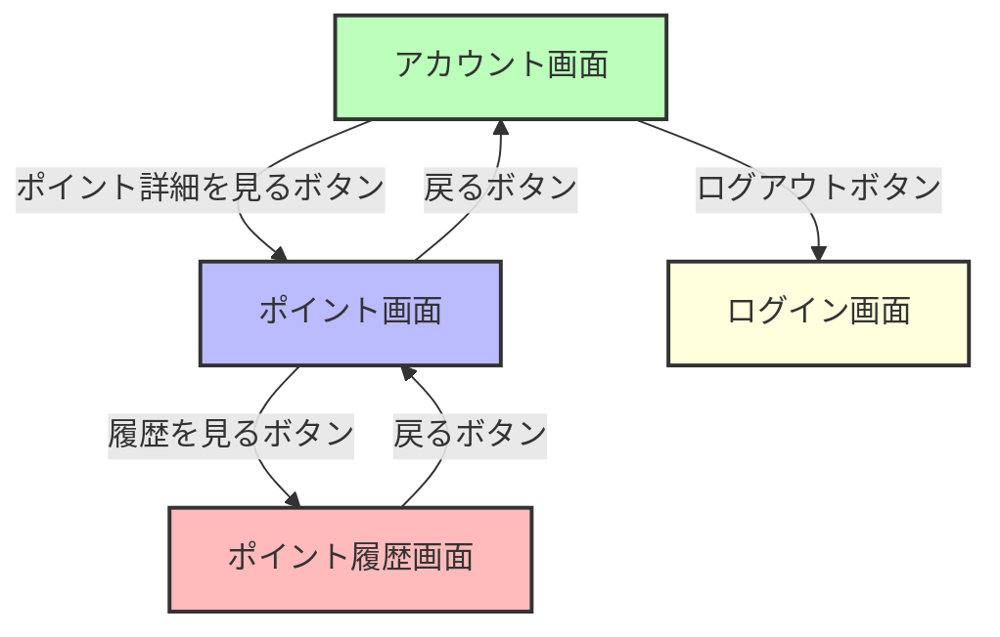
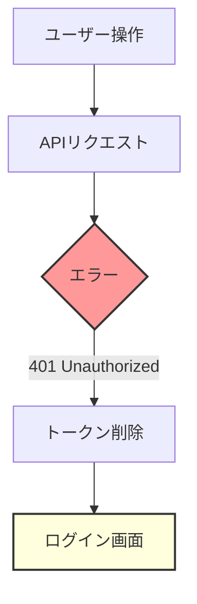
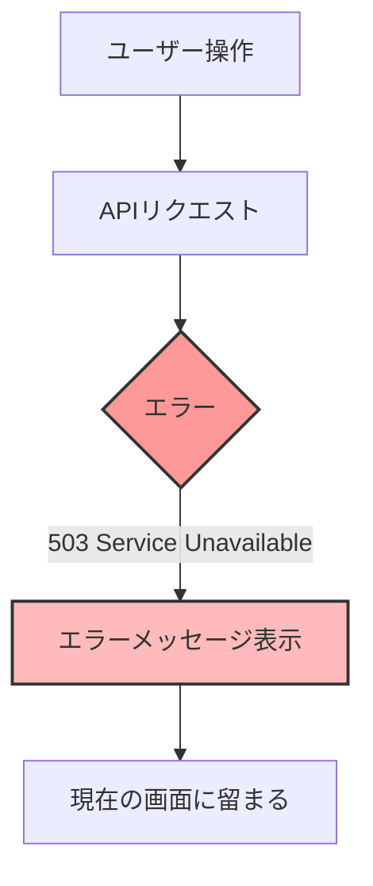

# 画面フロー図

## 画面構成

本アプリケーションは4つの画面で構成されています。



## 画面遷移パターン

### 1. 初回アクセス・未認証時



### 2. ログイン成功後



### 3. アカウント画面からの遷移



---

## 各画面の詳細

### 1. ログイン画面（/login）

**目的**: ユーザー認証

**表示内容**:
- ユーザーID入力欄（ユーザー名またはUUID）
- パスワード入力欄
- ログインボタン
- クリアボタン
- テストユーザー情報表示

**操作**:
- ユーザーIDとパスワードを入力してログイン
- クリアボタンでフォームをリセット

**遷移先**:
- ログイン成功 → アカウント画面（/account）
- ログイン失敗 → エラーメッセージ表示

**認証**: 不要

---

### 2. アカウント画面（/account）

**目的**: ユーザーの基本情報とポイント残高を表示

**表示内容**:
- ユーザー名
- メールアドレス
- 氏名
- 現在のポイント残高
- 「ポイント詳細を見る」ボタン
- ログアウトボタン

**操作**:
- 「ポイント詳細を見る」ボタン → ポイント画面へ遷移
- ログアウトボタン → ログアウト処理後、ログイン画面へ

**遷移先**:
- ポイント画面（/points）
- ログイン画面（/login）

**認証**: 必要（JWTトークン）

---

### 3. ポイント画面（/points）

**目的**: ポイント残高の詳細表示

**表示内容**:
- 現在のポイント残高
- 最終更新日時
- 「履歴を見る」ボタン
- 「戻る」ボタン
- ログアウトボタン

**操作**:
- 「履歴を見る」ボタン → ポイント履歴画面へ遷移
- 「戻る」ボタン → アカウント画面へ戻る
- ログアウトボタン → ログアウト処理後、ログイン画面へ

**遷移先**:
- ポイント履歴画面（/points/history）
- アカウント画面（/account）
- ログイン画面（/login）

**認証**: 必要（JWTトークン）

---

### 4. ポイント履歴画面（/points/history）

**目的**: ポイントの取引履歴を表示

**表示内容**:
- 現在のポイント残高
- ポイント履歴テーブル
  - 日付
  - 取引種別（獲得/使用）
  - ポイント数
  - 説明
  - 取引後残高
  - 有効期限
- ページネーション（前へ/次へボタン）
- 「戻る」ボタン
- ログアウトボタン

**操作**:
- ページネーションで履歴を閲覧
- 「戻る」ボタン → ポイント画面へ戻る
- ログアウトボタン → ログアウト処理後、ログイン画面へ

**遷移先**:
- ポイント画面（/points）
- ログイン画面（/login）

**認証**: 必要（JWTトークン）

---

## ナビゲーションガード

Vue Routerのナビゲーションガードにより、認証状態を制御します。

```javascript
router.beforeEach((to, from, next) => {
  const token = localStorage.getItem('authToken')
  
  if (to.meta.requiresAuth && !token) {
    // トークンがない場合はログイン画面へリダイレクト
    next('/login')
  } else {
    next()
  }
})
```

**保護されたルート**:
- /account
- /points
- /points/history

これらのルートにはJWTトークンが必要です。トークンがない場合は自動的に`/login`にリダイレクトされます。

---

## エラー処理フロー

### トークン期限切れ



### サービス停止時



---

## 画面状態管理

### localStorageに保存されるデータ

- `authToken`: JWTトークン（ログイン成功時に保存、ログアウト時に削除）

### Vueコンポーネントの状態

各画面はVue 3のComposition APIを使用して状態を管理します：

- `loading`: データ読み込み中フラグ
- `errorMessage`: エラーメッセージ
- `pointData`: ポイント情報
- `historyData`: ポイント履歴情報
- `currentPage`: 現在のページ番号（履歴画面）

---

## レスポンシブデザイン

本アプリケーションはTailwind CSSを使用しており、レスポンシブデザインに対応しています。スマートフォン、タブレット、デスクトップのすべてのデバイスで適切に表示されます。
